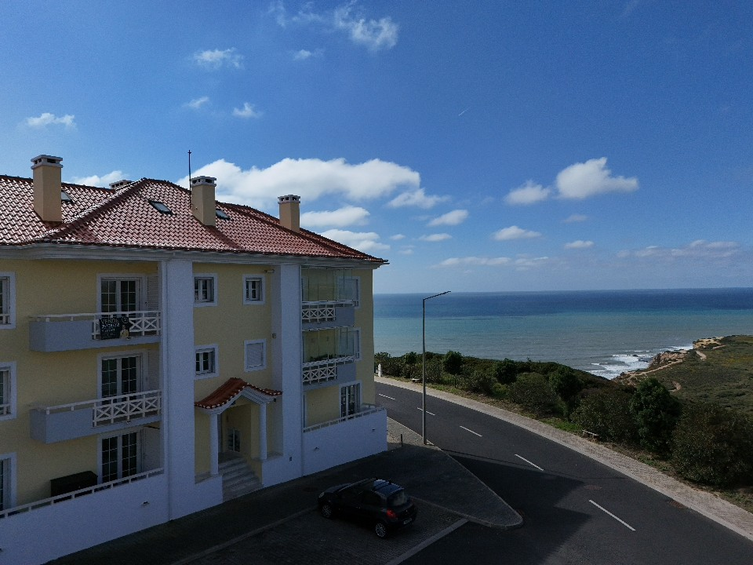
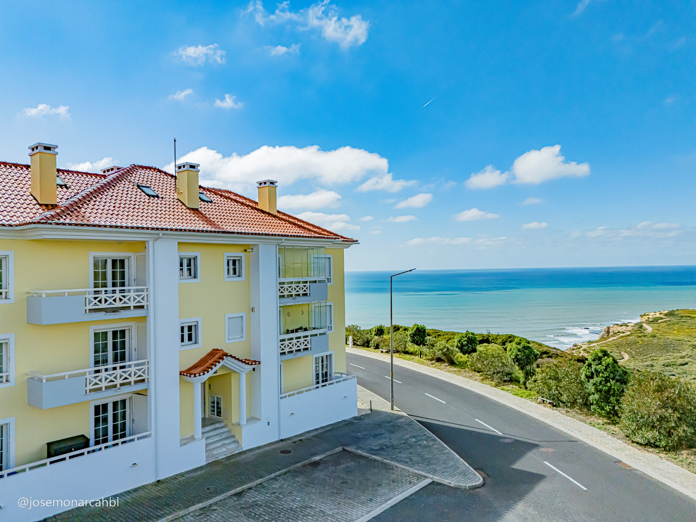

# 6 - Ajustar as fotografias dos imóveis com IA.

**Dúvida:**

Prompt para o ChatGPT ou outro site ou IA que automaticamente ajusta o brilho, cores e contraste das imagens, tal como no exemplo:

*Antes*

*Depois*

## Opções:

### Fotor

https://www.fotor.com/photo-editor-app/editor/basic

*Com a funcionalidade: 1-Tap Enhance*

*Resultado de exemplo:*

**Preço:**

*1 crédito = processar 1 foto*
| Plano | Créditos | Preço (Cobrado Anualmente) | Preço (Cobrado Mensalmente) |
| :---       | :--- | :---         | :---       | 
| Fotor Pro  | 100  |  €2.83/mês  |€7.49/mês  |
| Fotor Pro+ | 300  |  €6.24/mês  |€16.99/mês |

### letsenhance

https://letsenhance.io/pt/boost#

*Resultado de exemplo:*

**Preço:**

*1 crédito = processar 1 foto*

| Plano | Créditos | Preço (Cobrado Anualmente) | Preço (Cobrado Mensalmente) |
| :---    | :--- | :---    | :---    |
| Starter | 100  | $9/mês  | $12/mês |
| Pro     | 300  | $24/mês | $32/mês |
| Max     | 500  | $34/mês | $45/mês |

